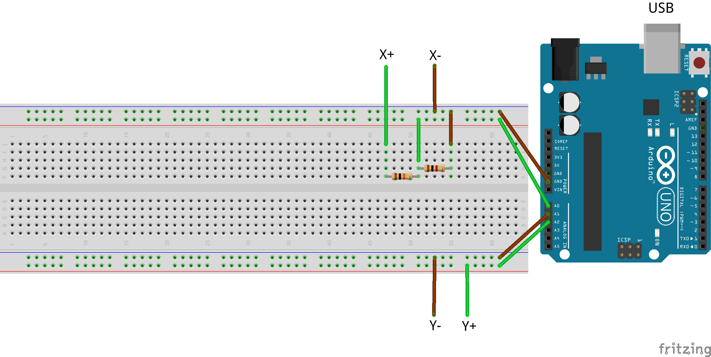

# Franckenstein

## Introduction
If you are reading this, you either want to explore some code which uses python to interpret data from a serial port (such as an Arduino) to make plots or you are a poor postgraduate student who got picked by Prof. Haddad to run the Franck-Hertz experiment for the second years. In either case, you might want to know a bit about how the code works.

As I vaguely mentioned above, this project was designed to read in inputs for a typical *Franck-Hertz* experiment (a small introduction to which can be seen [here](https://en.wikipedia.org/wiki/Franck–Hertz_experiment)). While the physics related to this experiment is incredibly interesting (and Nobel prize winning b.t.w.) this readme will focus on the technical aspects needed to convert signals into plots.

Typically, the plot one will get out of doing this experiment correctly looks as follows:

As far as I can tell from Wikipedia, this is a digital replica of the original plot produced by Franck and Hertz in their article: 
> Franck, J.; Hertz, G. (1914). "Über Zusammenstöße zwischen Elektronen und Molekülen des Quecksilberdampfes und die Ionisierungsspannung desselben"

In fact, if you can read German, you could check the article out [here](http://onlinelibrary.wiley.com/store/10.1002/phbl.19670230702/asset/19670230702_ftp.pdf;jsessionid=8830717D3F00675F3C07D987765D946D.f04t01?v=1&t=ikzwaqzj&s=803a62307652843302b93d4afba9e5424e874482&systemMessage=Wiley+Online+Library+will+be+unavailable+on+Saturday+27th+February+from+09%3A00-14%3A00+GMT+%2F+04%3A00-09%3A00+EST+%2F+17%3A00-22%3A00+SGT+for+essential+maintenance.++Apologies+for+the+inconvenience.).

Anyway, the point is that this is the kind of image which will come out of this experiment. The files in this repository will ultimately make plots for any two signals read into a serial port, but my discussion will mainly revolve around doing so for a Franck-Hertz experiment.

## Workings of the code
### On the Arduino

### On the PC

## Circuit set up

